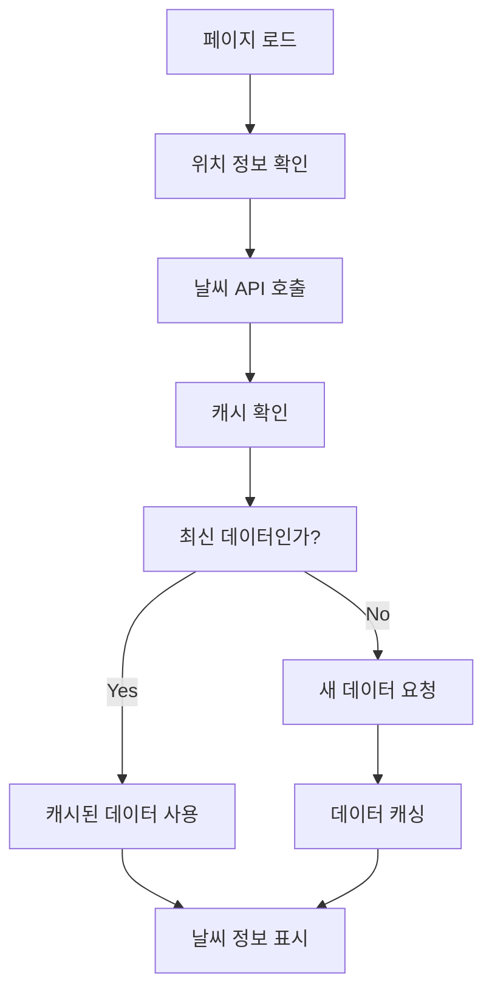
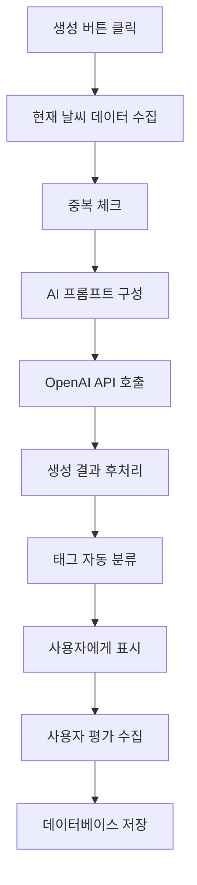

# 계절과 날씨를 고려한 문구 추천 기능 구현 계획

**작성일**: 2025년 9월 1일  
**우선순위**: HIGH (MVP 기능)  
**예상 개발 기간**: 2-3주  

---

## 📋 기능 개요

### 핵심 가치
- 교사가 매일 바뀌는 날씨와 계절에 맞는 적절한 알림장 문구를 자동으로 추천받을 수 있는 시스템
- 실시간 날씨 정보와 계절적 특성을 고려한 맞춤형 교육 메시지 생성
- 수동으로 날씨를 확인하고 문구를 작성하는 번거로움 해결

### 주요 기능
1. **실시간 날씨 기반 문구 생성**
2. **계절별 특화 문구 추천**
3. **특별 기상 상황 대응 문구**
4. **지역별 날씨 고려**
5. **중복 방지 시스템**

---

## 🎯 상세 기능 명세

### 1. 실시간 날씨 데이터 수집
```typescript
interface WeatherData {
  temperature: number;        // 기온 (°C)
  condition: string;         // 날씨 상태 (맑음, 흐림, 비, 눈 등)
  humidity: number;          // 습도 (%)
  windSpeed: number;         // 풍속 (m/s)
  uvIndex: number;           // 자외선 지수
  precipitation: number;      // 강수량 (mm)
  visibility: number;        // 가시거리 (km)
  airQuality: {              // 대기질 정보
    pm10: number;
    pm25: number;
    grade: string;           // 좋음, 보통, 나쁨, 매우나쁨
  };
  warnings: string[];        // 기상특보 (폭염, 한파, 호우 등)
}
```

### 2. 계절별 맞춤 문구 생성 로직

#### 봄 (3-5월)
**특징**: 미세먼지, 꽃가루, 일교차, 황사
```typescript
const springPrompts = {
  dusty: "미세먼지 농도가 높습니다. 마스크 착용하고 실외활동을 줄여주세요.",
  pollen: "꽃가루가 많이 날리는 시기입니다. 알레르기 있는 학생들은 특히 주의하세요.",
  temperatureDifference: "아침저녁으로 쌀쌀합니다. 겉옷을 준비해주세요.",
  yellowDust: "황사가 예보되었습니다. 창문을 닫고 외출 시 마스크를 착용하세요."
};
```

#### 여름 (6-8월)
**특징**: 폭염, 열대야, 장마, 태풍, 자외선
```typescript
const summerPrompts = {
  heatWave: "폭염특보가 발효되었습니다. 충분한 수분 섭취와 그늘에서 휴식하세요.",
  tropicalNight: "열대야가 계속되고 있습니다. 충분한 수면을 위해 시원한 환경을 만들어주세요.",
  rainyseason: "장마철입니다. 우산을 준비하고 미끄러짐 사고에 주의하세요.",
  uvRays: "자외선이 매우 강합니다. 모자나 양산을 사용하고 선크림을 발라주세요."
};
```

#### 가을 (9-11월)
**특징**: 일교차, 건조함, 단풍철, 독감 시즌
```typescript
const autumnPrompts = {
  dryness: "공기가 건조합니다. 수분 섭취를 늘리고 가습기 사용을 권장합니다.",
  temperatureDifference: "일교차가 큽니다. 겉옷을 준비하여 감기에 걸리지 않도록 주의하세요.",
  fluSeason: "독감 유행 시기입니다. 손 씻기와 마스크 착용을 생활화하세요."
};
```

#### 겨울 (12-2월)
**특징**: 한파, 빙판길, 실내외 온도차, 건조함
```typescript
const winterPrompts = {
  coldWave: "한파특보가 발효되었습니다. 따뜻하게 옷을 입고 동상에 주의하세요.",
  icyRoad: "길이 얼어 있습니다. 미끄러짐 사고에 각별히 주의하며 천천히 걸어주세요.",
  indoorOutdoorDifference: "실내외 온도차가 큽니다. 외출 시 충분히 준비하고 감기 예방에 힘쓰세요."
};
```

### 3. 특별 기상 상황 대응

#### 극한 날씨 대응
```typescript
interface ExtremeWeatherPrompts {
  typhoon: string;           // 태풍
  heavyRain: string;         // 호우
  heavySnow: string;         // 폭설
  strongWind: string;        // 강풍
  hail: string;             // 우박
  fog: string;              // 안개
}
```

#### 대기질 상황 대응
```typescript
interface AirQualityPrompts {
  veryGood: string;         // 매우 좋음
  good: string;             // 좋음
  moderate: string;         // 보통
  bad: string;              // 나쁨
  veryBad: string;          // 매우 나쁨
}
```

---

## 🛠 기술 구현 세부사항

### 1. 외부 API 연동

#### OpenWeatherMap API
```typescript
class WeatherService {
  private apiKey = process.env.OPENWEATHER_API_KEY;
  private baseUrl = 'https://api.openweathermap.org/data/2.5';

  async getCurrentWeather(city: string): Promise<WeatherData> {
    const response = await fetch(
      `${this.baseUrl}/weather?q=${city}&appid=${this.apiKey}&units=metric&lang=kr`
    );
    return this.parseWeatherData(await response.json());
  }

  async getAirQuality(lat: number, lon: number): Promise<AirQualityData> {
    const response = await fetch(
      `${this.baseUrl}/air_pollution?lat=${lat}&lon=${lon}&appid=${this.apiKey}`
    );
    return this.parseAirQualityData(await response.json());
  }
}
```

#### 기상청 API (한국 특화 정보)
```typescript
class KmaWeatherService {
  private baseUrl = 'http://apis.data.go.kr/1360000/VilageFcstInfoService_2.0';
  
  async getKoreanWeatherWarnings(): Promise<WeatherWarning[]> {
    // 기상특보 정보 조회
  }
  
  async getFineDustInfo(): Promise<FineDustData> {
    // 미세먼지 정보 조회
  }
}
```

### 2. AI 문구 생성 엔진

#### OpenAI GPT-4 연동
```typescript
class WeatherBasedAIGenerator {
  private openai: OpenAI;

  async generateWeatherNotice(weatherData: WeatherData, context: GenerationContext): Promise<string> {
    const prompt = this.buildPrompt(weatherData, context);
    
    const response = await this.openai.chat.completions.create({
      model: "gpt-4",
      messages: [
        { role: "system", content: this.getSystemPrompt() },
        { role: "user", content: prompt }
      ],
      temperature: 0.7,
      max_tokens: 300
    });

    return this.postProcessGeneration(response.choices[0].message.content);
  }

  private buildPrompt(weather: WeatherData, context: GenerationContext): string {
    return `
현재 날씨 정보:
- 날짜: ${context.date}
- 기온: ${weather.temperature}°C
- 날씨: ${weather.condition}
- 습도: ${weather.humidity}%
- 자외선 지수: ${weather.uvIndex}
- 미세먼지: ${weather.airQuality.grade}
- 기상특보: ${weather.warnings.join(', ') || '없음'}

요청사항:
- 초등학생들에게 적합한 알림장 문구 생성
- 위 날씨 상황에 맞는 안전 수칙 포함
- 긍정적이고 실용적인 내용
- 2-4문장으로 구성
- 구체적인 행동 지침 포함

문구 스타일: 친근하고 이해하기 쉬운 말투
`;
  }
}
```

### 3. 데이터베이스 설계

#### Supabase 테이블 구조
```sql
-- 날씨 기반 생성 이력
CREATE TABLE weather_generations (
  id UUID PRIMARY KEY DEFAULT gen_random_uuid(),
  user_id UUID REFERENCES auth.users(id),
  generation_date DATE NOT NULL,
  weather_data JSONB NOT NULL,
  generated_content TEXT NOT NULL,
  user_rating INTEGER CHECK (user_rating >= 1 AND user_rating <= 5),
  usage_count INTEGER DEFAULT 0,
  created_at TIMESTAMP WITH TIME ZONE DEFAULT NOW(),
  updated_at TIMESTAMP WITH TIME ZONE DEFAULT NOW()
);

-- 날씨 데이터 캐시
CREATE TABLE weather_cache (
  id UUID PRIMARY KEY DEFAULT gen_random_uuid(),
  location VARCHAR(100) NOT NULL,
  fetch_date DATE NOT NULL,
  weather_data JSONB NOT NULL,
  air_quality_data JSONB,
  cached_at TIMESTAMP WITH TIME ZONE DEFAULT NOW(),
  UNIQUE(location, fetch_date)
);

-- 사용자 선호도
CREATE TABLE user_weather_preferences (
  id UUID PRIMARY KEY DEFAULT gen_random_uuid(),
  user_id UUID REFERENCES auth.users(id),
  preferred_location VARCHAR(100) NOT NULL,
  notification_time TIME NOT NULL DEFAULT '06:00:00',
  auto_generation_enabled BOOLEAN DEFAULT true,
  created_at TIMESTAMP WITH TIME ZONE DEFAULT NOW(),
  UNIQUE(user_id)
);
```

### 4. 프론트엔드 구현

#### Vue 컴포넌트 구조
```typescript
// WeatherBasedGenerator.vue
<template>
  <div class="weather-generator">
    <div class="weather-info">
      <WeatherDisplay :weather="currentWeather" />
    </div>
    
    <div class="generation-controls">
      <button @click="generateNotice" :disabled="generating">
        <LoadingSpinner v-if="generating" />
        🤖 날씨 맞춤 문구 생성
      </button>
    </div>
    
    <div v-if="generatedNotice" class="generated-content">
      <NoticeCard 
        :notice="generatedNotice" 
        :show-weather-badge="true"
        @rate="handleRating"
      />
    </div>
  </div>
</template>
```

---

## 📊 데이터 플로우

### 1. 초기 로딩 프로세스


### 2. AI 문구 생성 프로세스


---

## 🎨 UI/UX 설계

### 1. 메인 화면 통합
```html
<!-- 기존 메인 화면에 추가될 섹션 -->
<section class="weather-section">
  <div class="weather-header">
    <h2>🌤️ 오늘의 날씨 맞춤 문구</h2>
    <div class="weather-info">
      <span class="temperature">28°C</span>
      <span class="condition">맑음</span>
      <span class="location">서울</span>
    </div>
  </div>
  
  <div class="ai-generated-notice">
    <!-- AI 생성 문구 표시 -->
  </div>
  
  <button class="generate-btn">
    🤖 새로운 날씨 문구 생성
  </button>
</section>
```

### 2. 생성 과정 피드백
```html
<div class="generation-status">
  <div class="step active">
    <span class="icon">🌦️</span>
    <span class="label">날씨 정보 수집</span>
  </div>
  <div class="step active">
    <span class="icon">🤖</span>
    <span class="label">AI 문구 생성 중...</span>
  </div>
  <div class="step">
    <span class="icon">✅</span>
    <span class="label">완료</span>
  </div>
</div>
```

---

## 🔧 개발 환경 설정

### 1. 환경 변수
```env
# .env 파일
OPENWEATHER_API_KEY=your_openweather_api_key
OPENAI_API_KEY=your_openai_api_key
KMA_API_KEY=your_kma_api_key
SUPABASE_URL=your_supabase_url
SUPABASE_ANON_KEY=your_supabase_anon_key
```

### 2. 패키지 설치
```bash
npm install openai axios
npm install @types/node
npm install date-fns  # 날짜 처리
```

### 3. 서비스 등록
```typescript
// src/services/index.ts
export { WeatherService } from './weatherService';
export { WeatherBasedAIGenerator } from './aiGenerationService';
export { WeatherCacheManager } from './cacheManager';
```

---

## 🧪 테스트 계획

### 1. 단위 테스트
```typescript
describe('WeatherBasedAIGenerator', () => {
  it('should generate appropriate notice for hot weather', async () => {
    const mockWeather = {
      temperature: 35,
      condition: '맑음',
      uvIndex: 9,
      warnings: ['폭염특보']
    };
    
    const result = await generator.generateWeatherNotice(mockWeather, context);
    
    expect(result).toContain('폭염');
    expect(result).toContain('수분');
    expect(result).toContain('그늘');
  });
});
```

### 2. 통합 테스트
- API 연동 테스트
- 실제 날씨 데이터로 생성 테스트
- 캐싱 시스템 테스트

### 3. 사용자 테스트
- 다양한 날씨 조건에서 생성 품질 평가
- 생성 속도 및 응답성 테스트
- 사용자 만족도 조사

---

## 📅 개발 일정

### Week 1: 기반 구조 구축
- [ ] WeatherService 구현
- [ ] 기본 AI 생성 서비스 구현
- [ ] 데이터베이스 테이블 생성
- [ ] 기본 UI 컴포넌트 구현

### Week 2: 핵심 기능 개발
- [ ] OpenAI API 연동
- [ ] 계절/날씨별 프롬프트 시스템
- [ ] 중복 방지 로직 구현
- [ ] 사용자 평가 시스템

### Week 3: 최적화 및 테스트
- [ ] 캐싱 시스템 구현
- [ ] 성능 최적화
- [ ] 전체 기능 테스트
- [ ] UI/UX 개선

---

## 🎯 성공 지표

### 기술적 지표
- API 응답 시간 < 3초
- 캐시 히트율 > 80%
- 생성 문구 품질 점수 > 4.0/5.0

### 사용자 지표
- 날씨 문구 사용률 > 60%
- 사용자 만족도 > 4.0/5.0
- 일일 생성 요청 > 100건

### 비즈니스 지표
- 전체 사용 시간 30% 증가
- 사용자 재방문율 증가
- 긍정적 피드백 증가

---

## 🚀 확장 계획

### Phase 2: 고도화
1. **학습 기능**: 사용자 피드백 기반 개인화
2. **예측 기능**: 내일 날씨 기반 미리 준비
3. **알림 기능**: 특별 기상 상황 자동 알림

### Phase 3: 통합
1. **다른 AI 기능과 결합**: 뉴스 + 날씨 통합 분석
2. **지역 특화**: 학교별 미세 기후 고려
3. **계절 이벤트**: 특별한 날짜/절기 고려

이 기능이 완성되면 교사들이 매일 아침 사이트를 방문하여 그날의 날씨에 맞는 완벽한 알림장 문구를 자동으로 받아볼 수 있게 됩니다! 🌟
